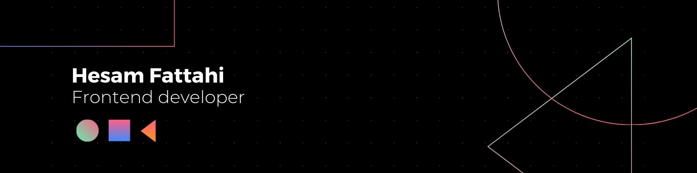

## Hi 👋, I'm Hesam.

A frontend developer passionate about crafting user-friendly web experiences. I enjoy learning new technologies and collaborating on exciting projects.

Here's my [Portfolio](https://hesamfattahi.netlify.app/).

## About me 💼

* 🔭 Currently working on improving some of the projects in my repositories.
* 🤝 Looking forward to joining a team of talented developers and exploring new opportunities.
* 🌱 Currently learning about testing and exploring Next.js. I’ll be uploading a new project based on Next.js soon!
* 🧑‍💻 Built projects on [Frontend Mentor](https://www.frontendmentor.io/profile/hesam-fattahi)
* 🚀 You can check out all of my projects in my [repositories](https://github.com/hesam-fattahi?tab=repositories) 

## Tech Stack 💻
                     

## Contact 📬

* Email: hesam.fattahi.hf@gmail.com
* GitHub: [https://github.com/hesam-fattahi](https://github.com/hesam-fattahi)
* LinkedIn: [https://www.linkedin.com/in/hesam-fattahi/](https://www.linkedin.com/in/hesam-fattahi/)

**Thank you for visiting my profile. 🙂**
