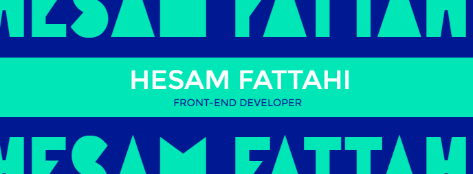

## Hesam Fattahi | Frontend Developer

I'm Hesam, a frontend developer passionate about crafting user-friendly web experiences. I enjoy learning new technologies and collaborating on exciting projects. 🚀

## Skills & Experience 💼

* Proficient in HTML, CSS, JavaScript (including React.js)
* Experience with build tools (Webpack, Babel) and version control (Git)
* Built projects on Frontend Mentor: [https://www.frontendmentor.io/profile/hesamf01](https://www.frontendmentor.io/profile/hesamf01)
* You can check out other projects in my [repositories](https://github.com/hesam-fattahi?tab=repositories) 

## Looking for 🔍

* Open-source contributions & collaborations
* Frontend development opportunities

## Contact 📬

* Email: hesam.fattahi.hf@gmail.com
* GitHub: [https://github.com/hesam-fattahi](https://github.com/hesam-fattahi)
* LinkedIn: [https://www.linkedin.com/in/hesam-fattahi/](https://www.linkedin.com/in/hesam-fattahi/)
